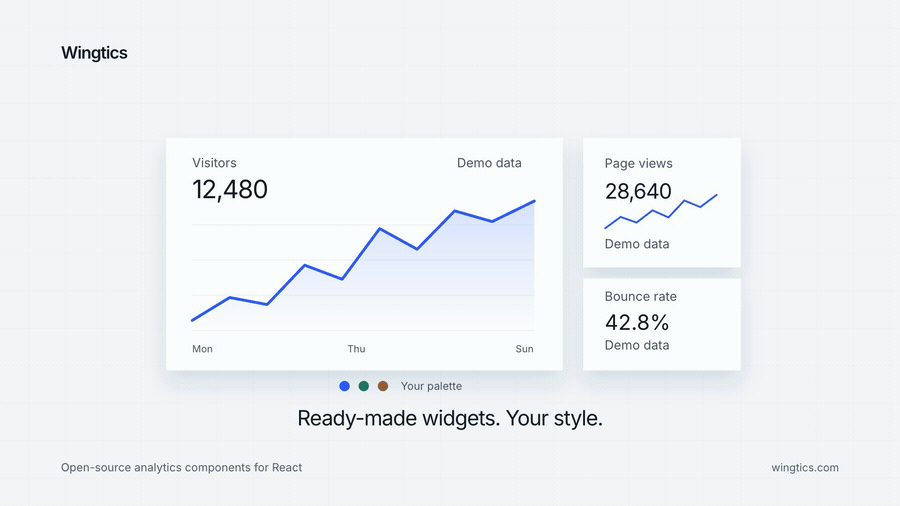

# Wingtics

[](https://github.com/educlopez/wingtics/actions/workflows/ci.yml)
[](https://www.npmjs.com/package/@wingtics/core)
[](LICENSE)

Provider-agnostic analytics for websites. You give users a **connector** for the analytics tool they already use, and **components** that render the data. Switching from Plausible to GA4 (or Vercel, Umami, PostHog) is a constructor change — the dashboard stays the same.



**[Live demo](https://wingtics.com)** · [Docs](https://wingtics.com/docs) · [Every component](https://wingtics.com/components)

```bash
pnpm add @wingtics/react @wingtics/core @wingtics/connector-plausible
```

```tsx
import { AnalyticsProvider, Dashboard } from "@wingtics/react";
import { createPlausibleConnector } from "@wingtics/connector-plausible";
import "@wingtics/react/styles.css";

const connector = createPlausibleConnector({
  apiKey: process.env.PLAUSIBLE_API_KEY!,
  siteId: "example.com",
});

export function Stats() {
  return (
    <AnalyticsProvider connector={connector}>
      <Dashboard />
    </AnalyticsProvider>
  );
}
```

This repo is a TypeScript monorepo designed so **new providers** and **new widgets** plug in without changing the query model.

## Packages

| Package                         | What it is                                                              |
| ------------------------------- | ----------------------------------------------------------------------- |
| `@wingtics/core`                | Canonical query/result types, connector contract, capabilities, caching |
| `@wingtics/react`               | Provider, hooks, chart primitives, widget registry, dashboard           |
| `@wingtics/next`                | Fetch / Next.js App Router handlers that keep API keys on the server    |
| `@wingtics/connector-plausible` | Plausible Stats API v2                                                  |
| `@wingtics/connector-vercel`    | Vercel Web Analytics API                                                |
| `@wingtics/connector-ga4`       | Google Analytics 4 Data API                                             |
| `@wingtics/connector-umami`     | Umami stats / metrics API                                               |
| `@wingtics/connector-posthog`   | PostHog HogQL                                                           |
| `@wingtics/connector-mock`      | Deterministic fake data + per-provider capability profiles              |

## How it scales

```
UI widgets  ──►  canonical AnalyticsQuery  ──►  connector.query()
     ▲                                              │
     │         capabilities decide what is shown     ▼
widget registry                               vendor API mapping
```

- **Providers** implement `defineConnector({ id, capabilities, query })`.
- **Widgets** implement `defineWidget({ id, required, component })`.
- A widget that needs `bounceRate` on a Vercel connector renders an “unsupported” state instead of crashing.
- Custom metrics/dimensions can be added at runtime with `registerMetric` / `registerDimension`, and via TypeScript declaration merging of `MetricCatalog` / `DimensionCatalog`.

### Add a provider

See [`examples/custom-connector.ts`](examples/custom-connector.ts). Minimum surface:

```ts
import { defineConnector } from "@wingtics/core";

export function createAcmeConnector(options) {
  return defineConnector({
    id: "acme",
    name: "Acme",
    capabilities: {
      metrics: { visitors: true, pageviews: true },
      dimensions: { path: true },
      granularity: ["day"],
      filters: false,
      realtime: false,
      previousPeriod: false,
    },
    async query(query) {
      // query.range.from/to are absolute Dates
      // query.metrics / dimensions are canonical IDs
      return { totals: { visitors: 0 }, series: [], breakdown: [] };
    },
  });
}
```

### Add a widget

See [`examples/custom-widget.tsx`](examples/custom-widget.tsx). Then reference it by id:

```tsx
<Dashboard widgets={[{ widget: "signups" }, { widget: "top-pages", span: 2 }]} />
```

Built-in widgets: `visitors`, `pageviews`, `visits`, `events`, `bounce-rate`, `duration`, `views-per-visit`, `realtime`, `timeseries`, `top-pages`, `pages-table`, `top-referrers`, `top-countries`, `devices`, `top-browsers`, `top-os`, `top-sources`, `top-campaigns`, `top-events`, `tracker`.

Primitives you can reuse in custom widgets: `WidgetFrame`, `Timeseries` / `AreaChart`, `RankedList` / `BarList`, `CategoryBars` / `BarChart`, `Donut`, `Sparkline`, `BreakdownTable`, `Tracker`, `MetricValue`.

Layouts: `defaultDashboard` (Vercel-friendly) and `catalogDashboard` (every widget).

Charts are Tailwind + Recharts, so they drop into a shadcn-style codebase without a second charting stack. Eighteen types, funnel through sunburst, each with a `variant` for the drawing — gradient, dither, hatched, glow — not a color theme. Colors inherit `--chart-1`…`--chart-5`, `--card`, `--foreground` from the host site.

```tsx
<AreaChart data={points} variant="gradient" />
<FunnelChart data={stages} variant="tape" />
<SankeyChart nodes={nodes} links={links} variant="flow" />
<HeatmapChart data={points} variant="calendar" />
```

| Component          | Variants                                                                                               |
| ------------------ | ------------------------------------------------------------------------------------------------------ |
| `AreaChart`        | `gradient`, `linear`, `natural`, `step`, `dots`, `spark`, `dither`, `glow`, `hatched`, `bars`, `solid` |
| `LineChart`        | `monotone`, `linear`, `step`, `dashed`, `dots`, `dither`, `glow`, `ping`, `rainbow`, `values`          |
| `BarChart`         | `vertical`, `horizontal`, `rounded`, `hatched`, `dither`, `glow`, `gradient`, `duotone`                |
| `PieChart`         | `donut`, `pie`, `legend`, `dither`, `rounded`, `radial`, `glow`                                        |
| `FunnelChart`      | `tape`, `steps`, `vertical`                                                                            |
| `RadarChart`       | `stroke`, `fill`, `glow`, `dither`                                                                     |
| `ComposedChart`    | `combo`, `highlight`, `overlay`                                                                        |
| `GaugeChart`       | `arc`, `ring`, `tick`                                                                                  |
| `ScatterChart`     | `dots`, `bubble`, `glow`                                                                               |
| `SankeyChart`      | `flow`, `gradient`, `dither`                                                                           |
| `CandlestickChart` | `ohlc`, `hollow`, `wick`                                                                               |
| `ChoroplethChart`  | `tiles`, `heat`, `dither`                                                                              |
| `LiveLineChart`    | `stream`, `glow`, `dashed`                                                                             |
| `RingChart`        | `stack`, `nested`, `track`                                                                             |
| `HeatmapChart`     | `calendar`, `matrix`, `dither`                                                                         |
| `SunburstChart`    | `nest`, `burst`                                                                                        |
| `ProfitLossChart`  | `fill`, `stroke`, `bars`                                                                               |
| `MetricCard`       | `default`, `spark`, `compact`, `hero`                                                                  |
| `RankedList`       | `bar`, `compact`, `table`                                                                              |

## shadcn registry

Widgets also ship as a [shadcn registry](https://ui.shadcn.com/docs/registry). Install a recipe; keep `@wingtics/react` for data:

```bash
pnpm dlx shadcn@latest add https://wingtics.com/r/dashboard.json
```

GitHub: `pnpm dlx shadcn@latest add educlopez/wingtics/metric-card`

Items: every catalog chart plus `metric-card` and `dashboard`.

The site serves `/r/{name}.json`. `NEXT_PUBLIC_SITE_URL` should be `https://wingtics.com` in Vercel so built registry items keep that origin.

Namespace:

```json
{
  "registries": {
    "@wingtics": "https://wingtics.com/r/{name}.json"
  }
}
```

```bash
pnpm dlx shadcn@latest add @wingtics/dashboard
```

## Server vs browser

Never put vendor API keys in the client. Use the Next handler (or any runtime that accepts a Fetch `Request`):

```ts
// app/api/analytics/route.ts
import { createPlausibleConnector } from "@wingtics/connector-plausible";
import { createRouteHandlers } from "@wingtics/next";

export const { GET, POST } = createRouteHandlers({
  connector: createPlausibleConnector({
    apiKey: process.env.PLAUSIBLE_API_KEY!,
    siteId: process.env.PLAUSIBLE_SITE_ID!,
  }),
});
```

```tsx
// client
import { createHttpConnector } from "@wingtics/core";

const connector = createHttpConnector({ endpoint: "/api/analytics" });
```

Full wiring: [`examples/next-app-route.ts`](examples/next-app-route.ts).

## Canonical model

Metrics: `visitors`, `pageviews`, `visits`, `bounceRate`, `avgDuration`, `viewsPerVisit`, `events`.

Dimensions: `path`, `referrer`, `country`, `device`, `browser`, `os`, `source`, `medium`, `campaign`, `eventName`, `host`.

Ranges: `today`, `24h`, `7d`, `28d`, `30d`, `90d`, `12mo`, `month`, `year`, or `{ from, to }`.

Connectors map those onto vendor names (GA4 `activeUsers`, Plausible `bounce_rate`, Vercel `requestPath`, …). Numbers are similar, not identical across vendors — that is documented per connector via `capabilities`.

## Demo

Live site: **https://wingtics.com**

- Docs — https://wingtics.com/docs
- Components — https://wingtics.com/components
- Area chart — https://wingtics.com/components/area-chart

The product site is the Next.js app at the repo root. The browser talks to `/api/v1/analytics`; vendor keys stay on the server via `@wingtics/next`.

1. Import `educlopez/wingtics` in Vercel.
2. Framework: **Next.js**. Root Directory: **empty** (repository root).
3. Install / build commands come from `vercel.json` (workspace install, package build, registry, then `next build`).
4. Enable **Web Analytics** on the project (Vercel dashboard → Analytics → Enable). Without it the
   query API returns `404 Web Analytics not found`.
5. Env (optional, for the live dashboard):
   - `ANALYTICS_VERCEL_TOKEN` — account token scoped to the team that owns the project
   - `ANALYTICS_VERCEL_PROJECT_ID`
   - `ANALYTICS_VERCEL_TEAM_ID`
   - `NEXT_PUBLIC_SITE_URL=https://wingtics.com`

The dashboard reports this site's own traffic, collected by `@vercel/analytics` in `app/layout.tsx`.
Set `ANALYTICS_VERCEL_PROJECT_ID` explicitly — the connector does not read Vercel's auto-injected
`VERCEL_PROJECT_ID`.

Without those analytics env vars, the dashboard uses the Vercel-profile mock shaped like this site's
own routes.

```bash
pnpm install
pnpm build
pnpm dev
```

## Development

pnpm workspace + TypeScript + Vitest + tsup (ESM and CJS). Node 20+.

```bash
pnpm check   # lint, format, test, typecheck, build, publint
```

CI runs that same gate on every pull request. Releases use [Changesets](https://github.com/changesets/changesets): merge to `main`, merge the Version Packages PR, and GitHub Actions publishes `@wingtics/*` to npm.

See [CONTRIBUTING.md](CONTRIBUTING.md) for the npm trusted-publishing setup and how to add providers or widgets.

## Renamed from Analytics Kit

Wingtics was called **Analytics Kit** until September 2026, and its packages moved from `@analytics-kit/*` to `@wingtics/*` at 0.6.0. The old scope stays on npm — deprecated with a pointer here, not removed — so nothing already installed breaks. New versions only land under `@wingtics/*`.
